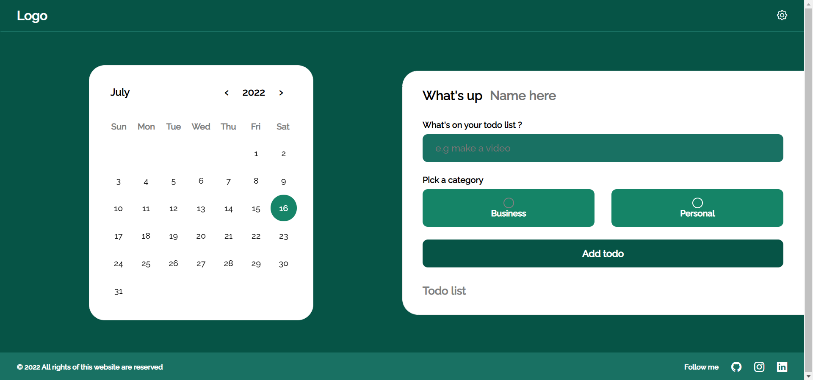
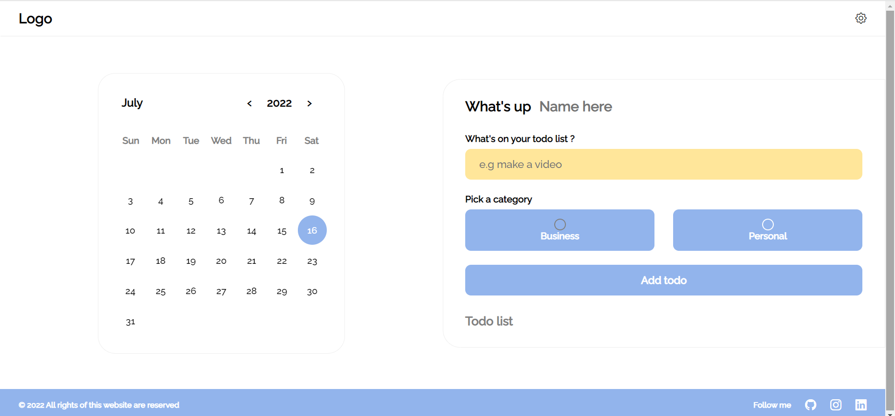
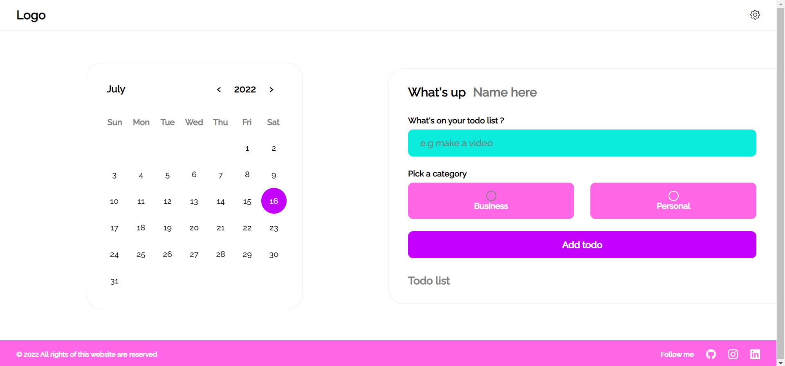
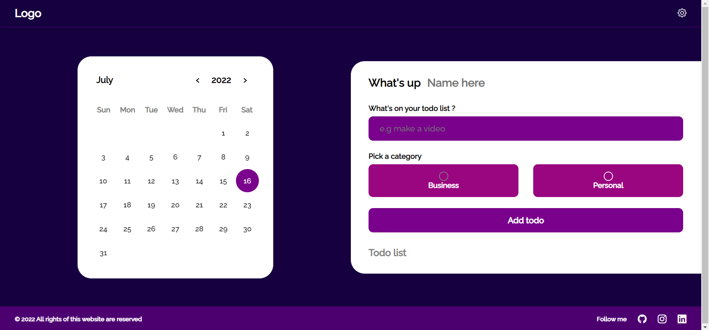

<h1 align="center">Task Manager Pro</h1>

</img> 

</img> 
</img>
</img> 

 

<h1>Introducing different sections of the website :</h1>
:gear: Setting section To change the color theme
  
:date: Calendar section
  
:card_index_dividers:Task Manager section
  

<h1> Features : </h1>
:art: It has four usable color themes 
  
:information_desk_person: Manage your task easily
  
:date: Has a calendar for better management of tasks
  
:file_folder: All information is stored in local storage
